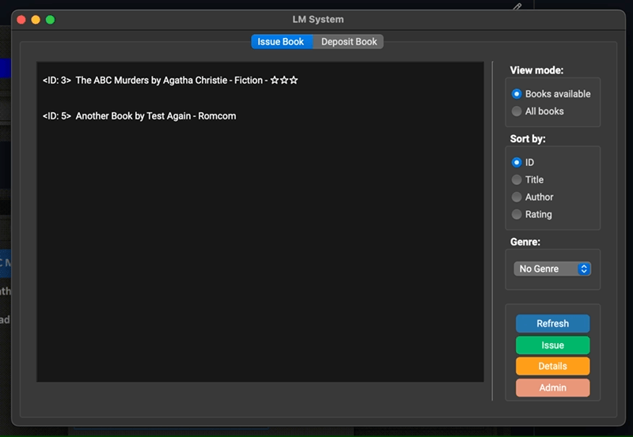

# Library-Management-System

A Library Management System app built using PySide6 and SQLite3.

Supports adding/deleting members and books, adding books using just ISBN number (Uses Google books API), issuing books (with filtering to find the right book), depositing books, viewing history of issued books and a rating system to rate books read.

**Tested on MacOS and Windows, build available only for M1 Macs and Windows x64.**

### Before building create a venv and install dependencies:
```
pip install virtualenv
virtualenv venv
source venv/bin/activate
pip install -r requirements.txt
```

### To Build (MacOS):

```
pyinstaller app.py -y --windowed --clean --name "LM System" --icon "icon.png" --distpath "./pyinstaller/dist" --workpath "./pyinstaller/build" --add-data "Assets:Assets"
```

### To Build (Windows):

```
pyinstaller app.py -y --onefile --noconsole --clean --name "LM System" --icon "icon.png" --distpath "./pyinstaller/dist" --workpath "./pyinstaller/build" --add-data "Assets;Assets"
```

### Link to Download:

https://drive.google.com/drive/folders/1KwaN11ke53sPyp_n8JTCHFvoG02Af1EY?usp=sharing

### Tables used:

#### Books:

- id (Primary & Autoincrement)
- title
- author
- rating (Average calculated from Rating table on return)
- genre
- add_date
- copies_total
- copies_issued

#### Members:

- id (Primary & Autoincrement)
- name
- DOB
- reg

#### Issue:

- id_user (Foreign from Members)
- id_book (Foreign from Books)
- issue_date (Generated on issue)
- return_date (Generated on return)

#### Rating:

- id_book (Foreign from Books)
- rating

### Demo:

#### Password Prompt:


#### Admin Window (Adding & Deleting):


#### Searching book online using ISBN:


#### Issue Feature:



#### Deposit Feature:


#### Prevention of Deletion:


